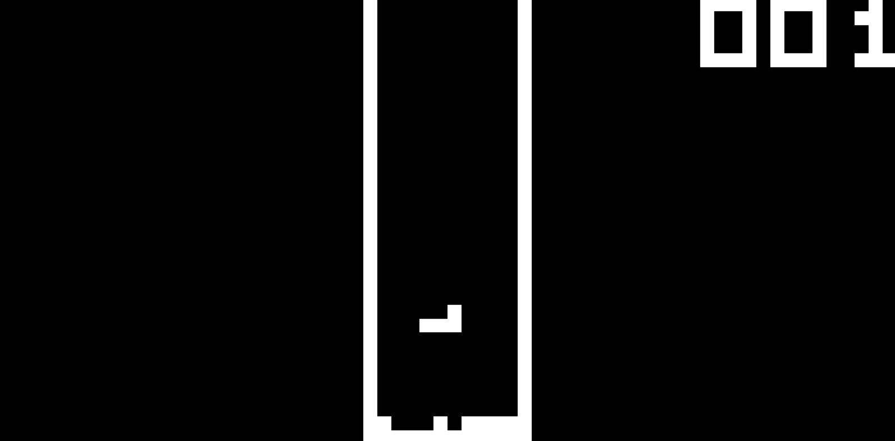

# tinyCHIP8

This project is an attempt to create an emulator for [CHIP-8](https://en.wikipedia.org/wiki/CHIP-8).

## Current Progress

- All modern instructions are implemented (with the modern definition)
- Able successfully run and display binary program (tested with running CHIP8 ROM)

## How to run
This code currently only supports windows.
### Dependencies
- mingw32 compiler
- SDL2 library

Given these requirements are met, code could be compile by running `mingw32-make` in the terminal.

Then, a CHIP-8 program binary could runned using `emu.exe [insert program name]` in the terminal.

## Demo
Example of working ROMs:

Space Invaders

Tetris

## Reference Documentation
[CHIP-8 Technical Reference](http://devernay.free.fr/hacks/chip8/C8TECH10.HTM#memmap)

[Mastering CHIP‐8](https://github.com/mattmikolay/chip-8/wiki/Mastering-CHIP%E2%80%908)
